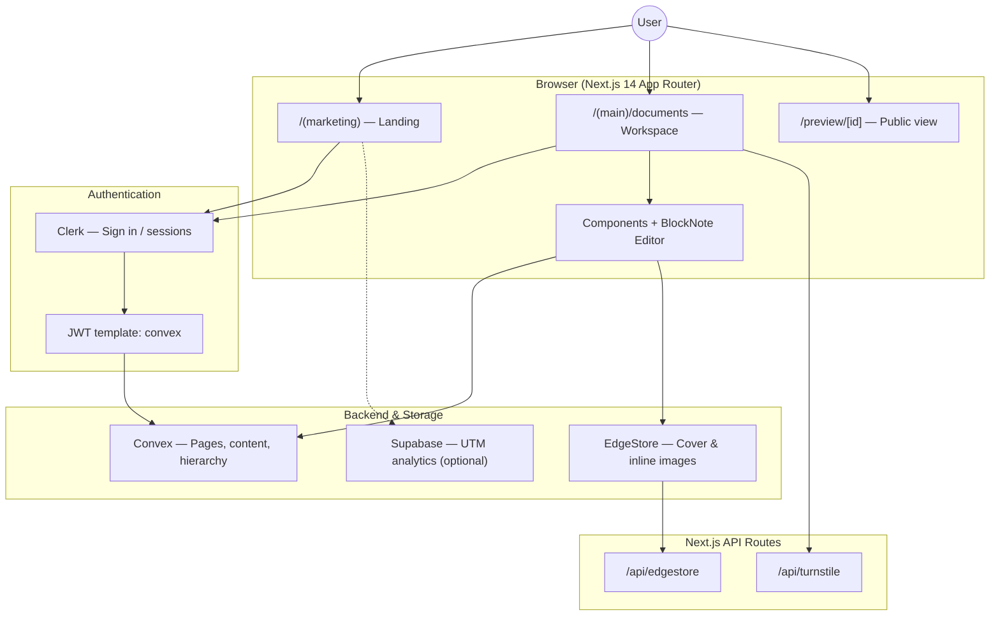

# Notation

### A slim Note taking workspace where docs are reimagined.

---

## Architecture



### Data flow (page save)

```text
User edits in BlockNote
       ↓
Editor onChange → JSON string
       ↓
Convex mutation (documents.update)
       ↓
Convex DB (documents table)
       ↓
Realtime subscription refreshes UI
```

### Auth flow

```text
User signs in (Clerk modal)
       ↓
Clerk issues JWT (template: "convex")
       ↓
ConvexProviderWithClerk passes token to Convex
       ↓
convex/documents.* checks userId from identity
       ↓
User can create / edit / delete their pages
```

---

## Tech stack

| Layer | Technology | Purpose |
|-------|------------|---------|
| Framework | Next.js 14, React 18, TypeScript | App shell, routing, SSR |
| Styling | Tailwind CSS, Radix UI, shadcn/ui | UI components & theming |
| Auth | Clerk + Convex JWT | Sign-in, user identity |
| Database | Convex | Documents, hierarchy, trash, publish state |
| Editor | BlockNote | Block-based rich text |
| File storage | EdgeStore | Cover images, editor uploads |
| State | Zustand | Modals, search, settings |
| Analytics | Supabase (optional) | UTM visit tracking |

---

## Folder strategy

```text
Notation/
├── app/
│   ├── (marketing)/          # Public landing page
│   ├── (main)/               # Authenticated workspace
│   │   ├── (routes)/documents/
│   │   └── _components/      # Sidebar, navbar, trash, publish
│   ├── (public)/             # Read-only published pages
│   ├── api/                  # EdgeStore + Turnstile routes
│   ├── utm-stats/            # Analytics dashboard (optional)
│   ├── layout.tsx            # Root providers & shell
│   └── globals.css
│
├── components/
│   ├── ui/                   # Reusable primitives (button, dialog, …)
│   ├── providers/            # Clerk, Convex, theme, EdgeStore
│   ├── modals/               # Settings, cover image, confirm
│   ├── Editor.tsx            # BlockNote editor
│   ├── Toolbar.tsx           # Title, icon, cover controls
│   └── Cover.tsx
│
├── convex/
│   ├── schema.ts             # documents table definition
│   ├── documents.ts          # CRUD, sidebar, trash, search
│   ├── auth.config.js        # Clerk JWT issuer for Convex
│   └── _generated/           # Auto-generated Convex types
│
├── hooks/                    # Zustand stores (search, settings, cover)
├── lib/                      # Utils, env helpers, EdgeStore client
├── libs/                     # Supabase admin clients
└── public/                   # Logos & static assets
```


## Live features

1. Marketing landing page with sign-in
2. Clerk authentication and personal workspace
3. Create pages (`Untitled` by default)
4. Nested pages with parent/child hierarchy
5. Sidebar page tree with expand/collapse
6. Resizable sidebar (240px–480px)
7. Mobile-responsive collapsible sidebar
8. Inline editable page title
9. Block-based rich text editor (BlockNote) with auto-save
10. Inline image upload (requires EdgeStore)
11. Page emoji icon (add, change, remove)
12. Cover image (upload, change, remove — requires EdgeStore)
13. Quick search across pages (⌘K / Ctrl+K)
14. Move pages to trash (soft delete)
15. Trash bin with title filter
16. Restore pages from trash (including nested children)
17. Delete pages permanently from trash
18. Trash banner on archived pages
19. Publish page to a public read-only link
20. Unpublish and copy share URL
21. Public preview at `/preview/[documentId]`
22. Light / dark / system theme
23. Settings modal (appearance)
24. Toast notifications for actions
25. Loading skeletons and empty states

---

## Upcoming Deliverables

Planned features and infrastructure improvements for future releases:

### Product features
- [ ] **Databases** — tables, boards, and filtered views (Notion-style)
- [ ] **Real-time collaboration** — multiple users editing the same page
- [ ] **Granular sharing** — invite specific users with view/edit roles
- [ ] **Comments & mentions** — inline discussions on blocks
- [ ] **Version history** — restore previous page snapshots
- [ ] **Templates** — starter pages and workspace templates
- [ ] **Backlinks & wiki links** — `[[page]]` references between documents
- [ ] **Import / export** — Markdown, PDF, and bulk export
- [ ] **Full-text search** — search inside page content, not just titles
- [ ] **Favorites / pinned pages** — quick access in sidebar
- [ ] **Keyboard shortcuts** — power-user navigation and formatting

### Infrastructure & scale
- [ ] **Production deployment** — Vercel + Convex prod + Clerk live keys
- [ ] **Custom Clerk domain** — branded auth on production
- [ ] **EdgeStore production bucket** — CDN-backed media at scale
- [ ] **Rate limiting** — API route protection (Turnstile + server limits)
- [ ] **Observability** — error tracking (Sentry) and usage analytics
- [ ] **E2E tests** — Playwright flows for auth, create, edit, publish
- [ ] **CI/CD pipeline** — lint, typecheck, build on every PR
- [ ] **Multi-workspace / teams** — org billing and shared spaces
- [ ] **BlockNote upgrade** — newer editor version with extended block types
- [ ] **Offline support** — local draft sync when connection drops

---

## Getting started

### Prerequisites

- Node.js 18+
- pnpm
- Accounts: [Convex](https://convex.dev), [Clerk](https://clerk.com), [EdgeStore](https://edgestore.dev) (for images)

### Install

```bash
pnpm install
cp .env.example .env.local
```

### Run (two terminals)

```bash
# Terminal 1 — Convex backend
pnpx convex dev

# Terminal 2 — Next.js frontend
pnpm dev
```

Open [http://localhost:3000](http://localhost:3000).

### Environment variables

See `.env.example` for the full list. Minimum for full functionality:

| Variable | Service |
|----------|---------|
| `NEXT_PUBLIC_CONVEX_URL` | Convex (auto-filled by `convex dev`) |
| `NEXT_PUBLIC_CLERK_PUBLISHABLE_KEY` | Clerk |
| `CLERK_SECRET_KEY` | Clerk |
| `EDGE_STORE_ACCESS_KEY` | EdgeStore |
| `EDGE_STORE_SECRET_KEY` | EdgeStore |

---

## License

Private project — all rights reserved.
